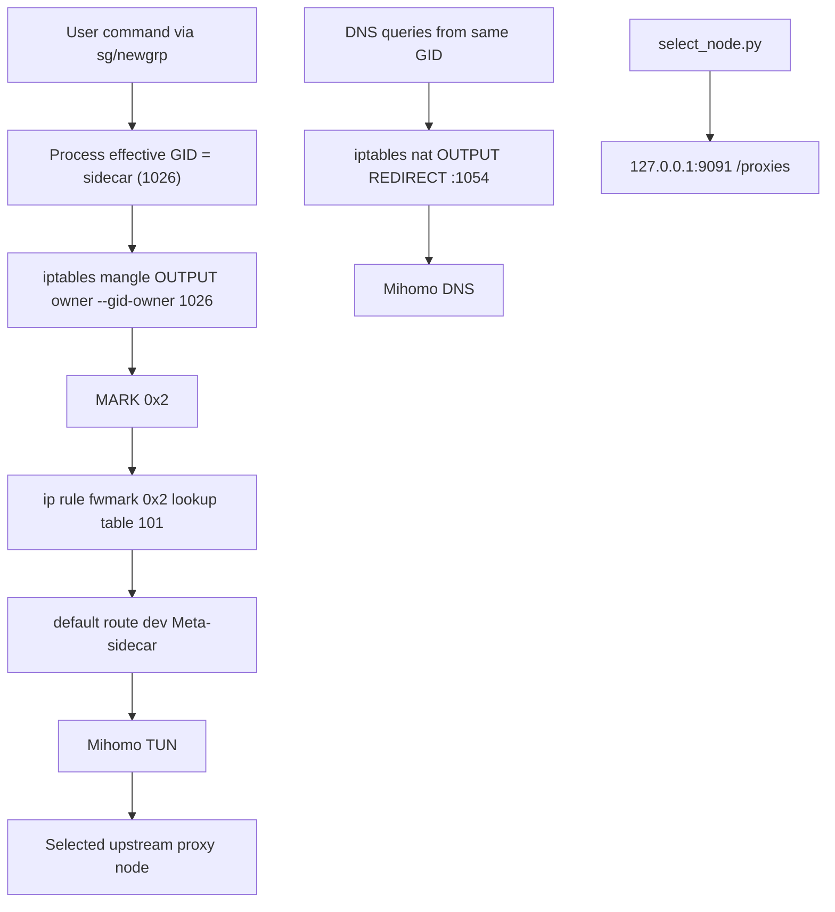

# Architecture

本文档面向开源发布读者，描述当前仓库已经存在的实现路径，以及后续演进时应保持的核心边界。

更细粒度的源码级分析见 [current-architecture.md](current-architecture.md)。

## 设计目标

本项目服务于“多用户 Linux 共享服务器上的代理隔离”场景。

核心原则：

- 默认先做进程级 sidecar，而不是整机全局代理
- 让代理影响范围尽量收敛到单个 GID 或单个用户
- 使用现成的 Mihomo TUN、DNS 和 controller 能力
- 维持清晰的启动、清理和排障路径

## 当前组件

当前已经存在的核心组件只有 4 个：

1. `创建服务`
2. `script/setup-rules.sh`
3. `script/cleanup-rules.sh`
4. `script/select_node.py`

它们分别承担：

- systemd 启动与生命周期挂钩
- 安装 sidecar 路由规则
- 删除 sidecar 路由规则
- 通过 Mihomo controller 进行节点选择

## 当前数据路径

## 当前默认约束

当前实现依赖一组固定参数：

- TUN 设备名：`Meta-sidecar`
- `fwmark`：`0x2`
- route table：`101`
- rule priority：`1001`
- DNS 端口：`1054`
- sidecar GID：`1026`
- controller：`127.0.0.1:9091`
- proxy group：`PROXY`

这也是为什么当前仓库还不适合作为“直接安装就能跑”的开源软件：它还缺统一配置层和资源自动探测。

## 运行假设

当前代码默认宿主机满足以下条件：

- Linux + systemd
- 存在 `ip`、`iptables`、`resolvectl`
- Mihomo 已正确安装
- Mihomo 配置中的 TUN / DNS / controller 参数与脚本硬编码一致
- 规则安装过程具有 root 权限
- 需要被代理的进程能够以 sidecar GID 运行

## 为什么采用 GID 匹配

相较于直接改整机默认路由，GID 匹配的优势是：

- 只代理被明确标记的进程
- 更适合共享服务器场景
- 规则清晰，便于恢复
- 不要求把整台机器的网络语义改成“永远经代理”

当前仓库还没有正式的 `sidecar` 命令，但 `.bashrc` 示例已经展示了如何通过 `sg sidecar -c ...` 把进程挂到目标 GID 上。

## 当前架构的短板

当前架构已经能跑通最小链路，但还缺少开源工具应有的外层能力：

- 安装与卸载闭环
- systemd 模板化
- 配置文件化
- 资源探测与冲突规避
- `sidecar` / `sidecar-on` 正式 CLI
- 验证与故障排查入口
- GID 模式与 UID 透明代理模式双支持

## 后续演进原则

为了尽量少动核心逻辑，建议按下面顺序演进：

1. 保留现有 `iptables + ip rule + Mihomo TUN` 这条底层链路。
2. 先把硬编码参数收敛到统一配置。
3. 再补安装器、卸载器和 systemd unit 模板。
4. 再做 `sidecar` CLI 和节点过滤。
5. 最后再引入 UID 透明代理和更强的资源自动探测。

这样可以最大程度复用现有脚本，而不是一开始就推倒重来。
