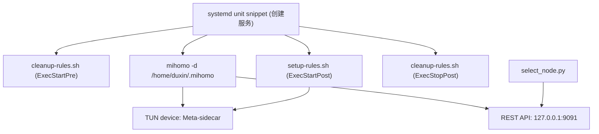

# Current Architecture

本文档只基于当前仓库中的 4 个实现文件进行分析：

- `创建服务`
- `script/setup-rules.sh`
- `script/cleanup-rules.sh`
- `script/select_node.py`

目标是描述当前实现的职责边界、耦合关系、运行假设和硬编码参数，不对现有逻辑做重写。

## 1. 当前实现是什么

当前仓库更接近“手工部署脚本集合”，而不是“可发布的开源工具”。

它已经覆盖了两块基础能力：

1. 通过 systemd 启动一个 Mihomo 实例，并在启动前后挂接网络规则。
2. 通过 Mihomo 本地 REST API 手工切换 `PROXY` 组中的节点。

它暂时还没有下面这些正式产品形态能力：

- 没有 `sidecar` CLI 入口
- 没有 `sidecar-on` CLI 入口
- 没有安装器、卸载器、配置文件模板
- 没有资源探测与冲突规避
- 没有面向不同用户、不同机器环境的参数化设计

## 2. 文件职责

## `创建服务`

这是一个写入 systemd unit 的命令片段，不是正式安装脚本。

它会创建 `mihomo-sidecar.service`，并定义以下流程：

1. `ExecStartPre=/home/duxin/.mihomo/cleanup-rules.sh`
2. `ExecStart=/usr/local/bin/mihomo -d /home/duxin/.mihomo`
3. `ExecStartPost=/home/duxin/.mihomo/setup-rules.sh`
4. `ExecStopPost=/home/duxin/.mihomo/cleanup-rules.sh`

这说明当前运行模型是：

- Mihomo 作为长期 systemd 服务运行
- 规则安装依赖 Mihomo 已经成功拉起
- 服务停止后做规则清理
- 服务启动前先尝试做一次历史残留清理

## `script/setup-rules.sh`

这个脚本负责建立“进程级 sidecar 代理”所需的内核网络规则。

核心动作：

1. 等待名为 `Meta-sidecar` 的 TUN 设备出现。
2. 用 `resolvectl` 清掉该 TUN 上可能被 systemd-resolved 绑定的 DNS 配置。
3. 用 `ip rule` + `ip route` 为特定 `fwmark` 建立策略路由表。
4. 用 `iptables -t mangle` 在 `OUTPUT` 链中匹配特定 GID 的进程流量，并打上 `fwmark`。
5. 用 `iptables -t nat` 在 `OUTPUT` 链中把同一 GID 进程的 DNS 请求重定向到 Mihomo DNS 端口。

结论：当前 sidecar 模式的真正实现核心，是“`owner --gid-owner` + `MARK` + policy routing + DNS REDIRECT”。

## `script/cleanup-rules.sh`

这个脚本负责删除 `setup-rules.sh` 创建的规则和链。

核心动作：

1. 删除 `mangle/OUTPUT` 对自定义链的跳转。
2. 删除自定义 `mangle` 链。
3. 删除对应的 `ip rule` 和表中默认路由。
4. 删除 `nat/OUTPUT` 对 DNS 链的跳转。
5. 删除自定义 `nat` 链。

结论：它和 `setup-rules.sh` 必须共享完全一致的参数，否则会清理不干净。

## `script/select_node.py`

这个脚本负责通过 Mihomo 的本地 HTTP API 读取 `PROXY` 组，并做交互式节点切换。

核心动作：

1. 从环境变量读取 `MIHOMO_API_SECRET`。
2. 访问 `http://127.0.0.1:9091/proxies`。
3. 强依赖存在一个名字固定为 `PROXY` 的代理组。
4. 列出组内所有节点并提示用户输入编号。
5. 通过 `PUT /proxies/PROXY` 切换当前节点。

结论：节点选择能力已经有雏形，但它是一个单用途脚本，不是可组合的 CLI 子命令。

## 3. 调用关系与耦合

当前 4 个文件的调用关系如下：

关键耦合点：

### 3.1 systemd unit 与规则脚本路径强耦合

`创建服务` 中把规则脚本路径写死为：

- `/home/duxin/.mihomo/cleanup-rules.sh`
- `/home/duxin/.mihomo/setup-rules.sh`

这意味着：

- 当前实现默认服务部署在特定用户目录
- 仓库内 `script/` 目录与服务实际运行路径并不一致
- 没有安装过程来保证脚本被复制到这些位置

### 3.2 规则脚本与 Mihomo TUN 名称强耦合

`setup-rules.sh` 和 `cleanup-rules.sh` 都写死了 `TUN_DEV="Meta-sidecar"`。

这意味着：

- Mihomo 配置里必须刚好创建这个名字的 TUN 接口
- 如果配置文件改名，脚本会直接失效

### 3.3 规则脚本之间参数强耦合

两份 shell 脚本必须共享一致的这些参数：

- `FWMARK="0x2"`
- `TABLE="101"`
- `PRIORITY="1001"`
- `TARGET_GID="1026"`
- `CHAIN_MANGLE="MIHOMO_SIDECAR"`
- `CHAIN_DNS="MIHOMO_DNS_SIDECAR"`

任何一边改了而另一边没改，都会导致“装得上，清不干净”或“清错对象”。

### 3.4 `setup-rules.sh` 与 Mihomo DNS 配置强耦合

`setup-rules.sh` 写死了 `DNS_PORT="1054"`。

这意味着：

- Mihomo 端必须在本地监听该 DNS 端口
- 否则被重定向的 DNS 请求会直接失败

### 3.5 `select_node.py` 与 Mihomo 控制面强耦合

它写死了：

- API 地址 `127.0.0.1:9091`
- Bearer Token 读取自 `MIHOMO_API_SECRET`
- 节点组名固定为 `PROXY`

这意味着当前节点切换功能只适用于一种特定 Mihomo 配置习惯。

## 4. 运行假设

从这 4 个文件可以反推出当前实现依赖的运行前提。

### 4.1 操作系统与服务管理

- 目标系统是 Linux
- 使用 systemd
- 具备 `network-online.target`

### 4.2 系统命令依赖

规则脚本默认系统里存在：

- `ip`
- `iptables`
- `resolvectl`
- `sleep`
- `seq`

节点切换脚本默认系统里存在：

- `python3`

### 4.3 权限模型

规则脚本需要足够权限操作：

- `iptables`
- `ip rule`
- `ip route`
- `resolvectl`

因此它们默认在 root 权限或等效能力下运行，而这一点当前只隐含在 systemd 服务创建片段里，没有显式检查。

### 4.4 Mihomo 运行前提

从现有脚本可推断，当前 Mihomo 配置必须满足至少这些条件：

- 能启动 TUN
- TUN 名称是 `Meta-sidecar`
- 本地 DNS 监听端口是 `1054`
- 本地 external controller 监听 `127.0.0.1:9091`
- API secret 需要由外部环境提供给 `select_node.py`
- 代理组中存在 `PROXY`

### 4.5 使用方式假设

当前“sidecar”能力并不是通过 `sidecar <cmd>` 命令实现，而是通过“把某些进程跑在特定有效 GID 下”实现。

这意味着仓库实际上只实现了：

- 基于 `gid-owner` 的流量匹配基础设施

但还没实现：

- 用户可直接调用的 `sidecar` 命令封装
- 对普通用户友好的组切换、环境注入和错误提示

## 5. 硬编码参数清单

以下参数目前都直接写死在源码或片段中：

| 位置 | 参数 | 当前值 | 作用 |
| --- | --- | --- | --- |
| `script/setup-rules.sh` | `TUN_DEV` | `Meta-sidecar` | 策略路由出口 TUN 名称 |
| `script/setup-rules.sh` | `FWMARK` | `0x2` | 流量标记 |
| `script/setup-rules.sh` | `TABLE` | `101` | 策略路由表 |
| `script/setup-rules.sh` | `PRIORITY` | `1001` | `ip rule` 优先级 |
| `script/setup-rules.sh` | `DNS_PORT` | `1054` | Mihomo DNS 接收端口 |
| `script/setup-rules.sh` | `TARGET_GID` | `1026` | 被代理进程的有效 GID |
| `script/setup-rules.sh` | `CHAIN_MANGLE` | `MIHOMO_SIDECAR` | mangle 链名 |
| `script/setup-rules.sh` | `CHAIN_DNS` | `MIHOMO_DNS_SIDECAR` | nat 链名 |
| `script/select_node.py` | `API_PORT` | `9091` | Mihomo 控制 API 端口 |
| `script/select_node.py` | 绑定地址 | `127.0.0.1` | Mihomo 控制 API 地址 |
| `script/select_node.py` | 代理组名 | `PROXY` | 节点切换目标组 |
| `创建服务` | Mihomo 可执行文件 | `/usr/local/bin/mihomo` | 主程序路径 |
| `创建服务` | 工作目录 | `/home/duxin/.mihomo` | Mihomo 配置目录 |
| `创建服务` | 规则脚本路径 | `/home/duxin/.mihomo/*.sh` | 运行期脚本位置 |
| `创建服务` | 服务名 | `mihomo-sidecar.service` | systemd unit 名称 |

## 6. 当前实现的优点

尽管还是原型，它已经有几个对后续开源化很有价值的基础点：

- 启动/清理分离明确，便于重构成 install/runtime/uninstall 三段式流程。
- 规则具备一定幂等性意识，例如先删旧规则、链存在时先 `-F`。
- 节点切换不依赖第三方 Python 库，后续可以继续保持“零额外依赖”。
- 当前 sidecar 的内核路径清晰，适合作为后续 CLI 的底层实现。

## 7. 当前实现的主要限制

仅从这 4 个文件出发，当前版本距离“可发布开源软件”还有明显差距：

- 参数不可配置，且大量绑定到单机单用户环境。
- 缺少安装、升级、卸载、回滚流程。
- 缺少资源自动探测与冲突规避。
- 缺少 CLI 产品层，用户只能手工拼 systemd、GID 和脚本。
- 缺少透明代理模式，也没有 UID 维度规则实现。
- 缺少节点过滤、默认策略、非交互切换能力。
- 缺少验证命令、诊断命令和故障排查文档。
- 缺少对不同发行版、`iptables-nft`/legacy 差异、systemd 环境差异的兼容处理。

## 8. 开源化重构时的建议边界

为了降低风险，建议保留当前实现中的“内核规则基本机制”不变，优先做外层产品化：

1. 先抽出统一配置层，消灭双份 shell 脚本里的重复硬编码。
2. 再补安装器、卸载器、systemd unit 模板和 bashrc/snippet 生成。
3. 再在现有规则机制外层包装 `sidecar` 与 `sidecar-on`。
4. 最后才考虑更深层的规则重构、兼容层和可观测性增强。

这样可以先把“一次性脚本”变成“可安装、可配置、可诊断的工具”，而不是一开始就重写内核规则路径。
